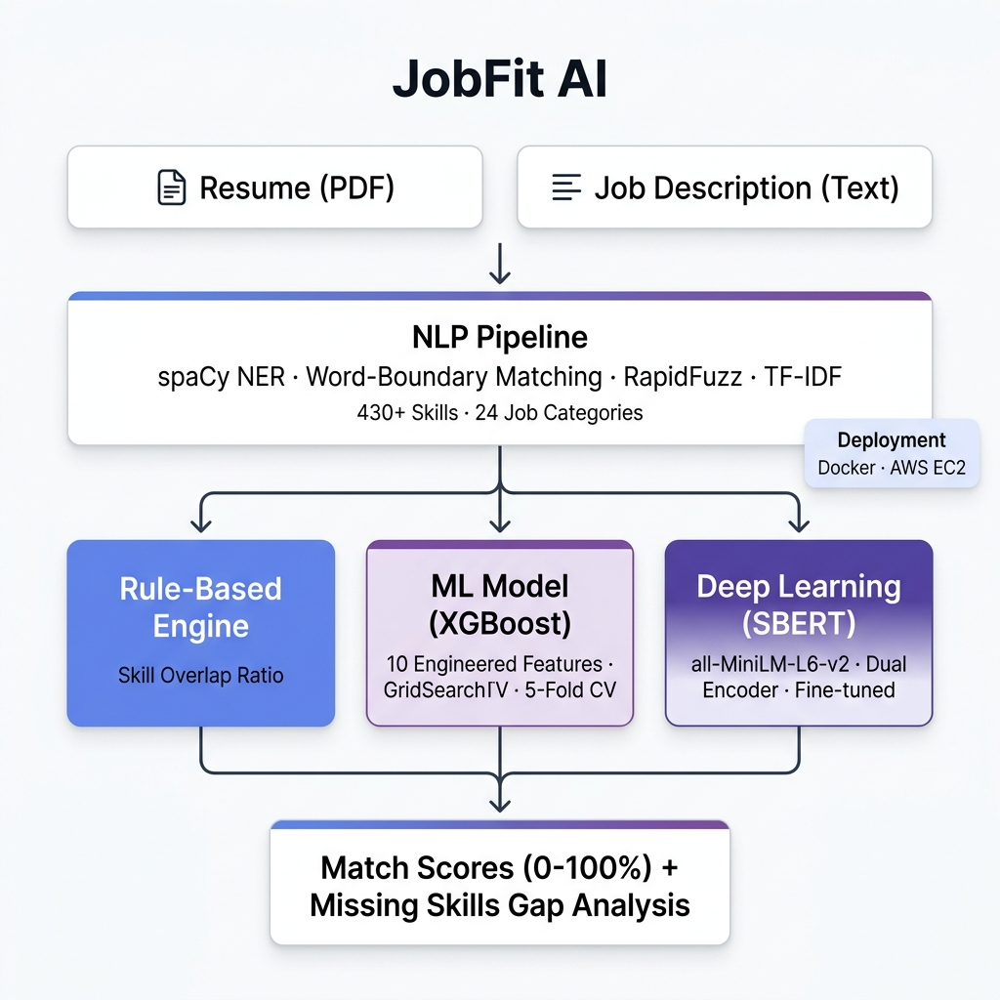

<div align="center">

# JobFit AI

**Intelligent Resume-Job Description Matching Engine**

[](https://python.org)
[](https://pytorch.org)
[](https://streamlit.io)
[](https://docker.com)
[](https://aws.amazon.com)
[](LICENSE)

[Live Demo](http://54.211.51.42:8501) · [Report Bug](https://github.com/vatsalyd/JobFit-AI/issues) · [Request Feature](https://github.com/vatsalyd/JobFit-AI/issues)

</div>

---

## About

JobFit AI is an end-to-end resume-job description matching system that goes beyond simple keyword matching. It combines **rule-based skill extraction**, a **gradient-boosted ML model**, and a **fine-tuned Sentence-BERT deep learning model** to produce accurate, multi-dimensional match scores.

Upload a resume (PDF), paste a job description, and get instant insights on skill alignment, match confidence, and missing competencies.

---

## What's New (v2.0)

- **Real Training Data** — 13,000+ resume-JD pairs from Kaggle across 24 job categories (replaced synthetic data)
- **Rank-Based Label Scoring** — Uniform 0-100 label distribution (mean=50, std=21.5) for better model calibration
- **430+ Skill Dictionary** — Expanded from 203 to 430+ skills covering HR, Legal, Engineering, Healthcare, Finance, and more
- **Smarter Skill Extraction** — Word-boundary exact matching for short skills (no more false positives like "r" matching "resume")
- **10 Engineered Features** — Added Jaccard similarity, TF-IDF cosine, skill density, and skill counts
- **Deeper DL Architecture** — 3-layer regression head (512→128→1) with BatchNorm, GELU, and dropout
- **Docker Deployment** — Production-ready containerization with CPU-only PyTorch
- **AWS EC2 Hosting** — Live deployment on t3.small with auto-restart

---

## Architecture

<div align="center">

</div>

---

## Models

| Model | Approach | Input | Output |
|---|---|---|---|
| **Rule-Based** | Exact skill overlap ratio | Skill sets | `matched / total_jd_skills × 100` |
| **ML (XGBoost)** | Gradient-boosted regression on 10 features | Engineered features | 0-100 match score |
| **DL (SBERT)** | Dual-encoder with regression head | Raw resume + JD text | 0-100 match score |

### ML Features

| Feature | Description |
|---|---|
| `skill_overlap` | Number of matched skills |
| `missing_skills` | Number of JD skills not in resume |
| `bert_similarity` | SBERT cosine similarity between full texts |
| `resume_len` / `jd_len` | Word counts |
| `skill_density` | `skill_overlap / jd_skill_count` |
| `jaccard_similarity` | Jaccard index on skill sets |
| `tfidf_cosine` | TF-IDF cosine similarity |
| `resume_skill_count` / `jd_skill_count` | Total skills detected |

### DL Architecture

```
all-MiniLM-L6-v2 (frozen/fine-tuned)
        │
  ┌─────┴─────┐
  │  Resume   │  │   JD     │    Dual Encoder
  │  Encoder  │  │  Encoder │    (shared weights)
  └─────┬─────┘  └────┬─────┘
        │              │
        └──────┬───────┘
               │ concat (768×2 = 1536)
        ┌──────▼──────┐
        │ Linear(1536, 512) → BatchNorm → GELU → Dropout(0.3)
        │ Linear(512, 128)  → GELU → Dropout(0.2)
        │ Linear(128, 1)    → Sigmoid
        └──────┬──────┘
               │
          Match Score (0-1)
```

---

## Quick Start

### Run Locally

```bash
git clone https://github.com/vatsalyd/JobFit-AI.git
cd JobFit-AI
pip install -r requirements.txt
streamlit run app.py
```

### Run with Docker

```bash
docker build -t jobfit-ai .
docker run -p 8501:8501 jobfit-ai
```

Open **http://localhost:8501**

---

## Training Pipeline

```bash
# 1. Collect real resume-JD pairs from Kaggle datasets
python collect_data.py

# 2. Compute features + rank-based labels
python data_prep.py

# 3. Train ML model (RF/GBR/XGBoost with GridSearchCV)
python train_ml.py

# 4. Fine-tune DL model (GPU recommended — use Colab notebook)
python train_dl.py
```

### Data Pipeline

| Stage | Script | Output |
|---|---|---|
| Collection | `collect_data.py` | 13,000+ resume-JD pairs across 24 categories |
| Feature Engineering | `data_prep.py` | 10 features + rank-normalized labels (0-100) |
| ML Training | `train_ml.py` | Best of RF/GBR/XGBoost via 5-fold GridSearchCV |
| DL Training | `train_dl.py` | SBERT fine-tuning with OneCycleLR + early stopping |

---

## Project Structure

```
JobFit-AI/
├── app.py                    # Streamlit web application
├── utils.py                  # Skill extraction, feature computation (10 features)
├── dl_model_wrapper.py       # DL model inference wrapper
├── data_prep.py              # Feature engineering + rank-based label generation
├── collect_data.py           # Data collection from Kaggle datasets
├── train_ml.py               # ML training pipeline
├── train_dl.py               # DL training pipeline
├── Dockerfile                # Production Docker config
├── data/
│   └── skills.txt            # 430+ skills across 24 job domains
├── models/
│   ├── ml_model.joblib       # Trained XGBoost model
│   ├── ml_scaler.joblib      # StandardScaler for ML features
│   ├── ml_metrics.json       # Evaluation metrics
│   └── dl_resume_match/      # Fine-tuned SBERT weights (88MB)
├── notebooks/
│   └── train_dl_colab.ipynb  # Colab notebook for GPU training
└── requirements.txt
```

---

## Deployment

Deployed on **AWS EC2** (t3.small, Ubuntu 24.04) with Docker:

```bash
ssh -i key.pem ubuntu@<EC2_IP>
git clone https://github.com/vatsalyd/JobFit-AI.git
cd JobFit-AI
docker build -t jobfit-ai .
docker run -d --restart unless-stopped -p 8501:8501 jobfit-ai
```

---

## Tech Stack

| Category | Technologies |
|---|---|
| **Frontend** | Streamlit |
| **ML** | scikit-learn, XGBoost, GridSearchCV |
| **Deep Learning** | PyTorch, Sentence-Transformers (all-MiniLM-L6-v2) |
| **NLP** | spaCy, RapidFuzz, TF-IDF (sklearn) |
| **Deployment** | Docker, AWS EC2 |
| **Data** | pandas, NumPy |

---

## License

MIT License © 2025 [Vatsal Yadav](https://github.com/vatsalyd)
